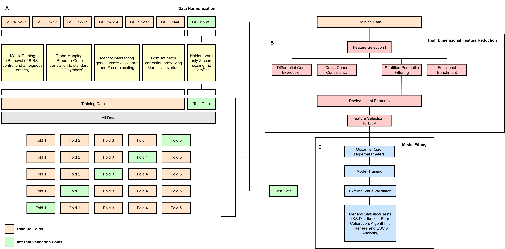

# Machine Learning Discovers a Robust 36-Gene Transcriptomic Signature for Sepsis Mortality

A machine learning framework that identifies and validates a 36-gene transcriptomic biomarker panel for predicting sepsis patient mortality. This work integrates multi-cohort genomic data, batch correction, feature selection, and external validation.

## Overview

This project develops a prognostic transcriptomic signature for sepsis mortality risk stratification using publicly available GEO datasets. The study focuses specifically on mortality prediction within confirmed sepsis patients, excluding healthy controls and non-infectious inflammatory samples to emphasize outcome-related transcriptomic variation.

**Key approach:** Multi-cohort integration with strict external validation to assess generalizability across independent datasets.

## Repository Structure

```
genomic_model_sepsis/
├── data/
│   ├── raw/                          # Raw GEO datasets
│   │   └── geo_metadata/
│   ├── processed/
│   │   ├── mapped_matrices/          # Per-cohort harmonized expression matrices
│   │   ├── matrices/                 # Master clinical labels
│   │   ├── deg_tensors/              # Candidate gene subsets
│   │   └── ml_tensors/               # Train/Atlas/Vault tensors for ML pipeline
│   └── README_DATA.md
├── src/
│   ├── 01_geo_datasets/              # GEO data retrieval & preprocessing
│   ├── 02_geo_datasets/              # Gene mapping & harmonization
│   ├── 03_models/                    # ML algorithms & feature selection
│   │   ├── 01_algorithm_benchmarking.py       # Multi-algorithm comparison
│   │   ├── 02_deg_filtering.py                # Candidate gene identification
│   │   ├── 03_rfecv_optimization.py           # Feature elimination with CV
│   │   ├── 05_feature_selection_shap.py       # SHAP feature importance
│   │   └── 06_vault_validation.py             # External validation pipeline
│   ├── 04_statistics/                # Statistical validation
│   │   ├── 01_batch_effect_anova.py           # Batch effect assessment
│   │   ├── 02_distribution_analysis.py        # Gene-outcome associations
│   │   ├── 03_model_calibration.py            # Brier-score assessment
│   │   ├── 04_algorithmic_fairness.py         # Demographic performance
│   │   └── 05_loco_meta_analysis.py           # Leave-one-cohort-out analysis
│   └── 05_visualization/             # Figure generation scripts
├── outputs/
│   ├── models/                       # Trained models
│   ├── features/                     # Gene panels & importance scores
│   ├── metrics/                      # Performance evaluations
│   └── figures/                      # Manuscript figures
├── docker                            # Scripts for environment setup
└── README.md
```

## Workflow


The workflow encompasses:

- **Data Harmonization (Panel A):** Seven public GEO datasets are integrated with probe-to-gene mapping, gene intersection identification, Z-score normalization, and ComBat batch correction. GSE65682 is held out as an external validation vault.

- **Feature Selection (Panel B):** Candidate genes are identified through differential expression analysis with cross-cohort consistency filtering and functional enrichment. Recursive Feature Elimination with Cross-Validation (RFECV) reduces the candidate set to a final biomarker panel.

- **Model Training and Validation (Panel C):** The XGBoost classifier is trained with stratified cross-validation on training data, followed by external validation on the held-out cohort. Statistical tests assess model calibration, demographic fairness, and generalizability via leave-one-cohort-out analysis.

## Key Results

The analysis identified a 36-gene biomarker panel from an initial background of 7,964 intersecting genes. Internal cross-validation achieved AUROC 0.80 (±0.02), while external validation on the unharmonized holdout cohort (GSE65682) yielded AUROC 0.66 (95% CI: 0.60–0.72). Leave-one-cohort-out analysis showed pooled AUROC 0.69 with moderate between-cohort heterogeneity (I² = 42.3%).

Performance was similar across demographic subgroups (male/female AUROC ~0.66; <60 years AUROC 0.68, ≥60 years AUROC 0.66). Model calibration on external validation showed a Brier score of 0.208.

## Technologies Used

- **Machine Learning:** XGBoost, scikit-learn, Random Forest, SVM, Logistic Regression
- **Data Processing:** pandas, NumPy, scipy
- **Batch Correction:** neuroCombat (Empirical Bayes)
- **Interpretation:** SHAP (TreeExplainer)
- **Visualization:** matplotlib, seaborn
- **Statistical Testing:** scipy.stats

## Study Design Details

The analysis used data from 1,636 sepsis patients across seven GEO datasets. Training data consisted of six cohorts (N=1,157) with external validation on GSE65682 (N=479). ComBat batch correction was applied to training cohorts but not to the external validation cohort to prevent information leakage. Model development focused on mortality prediction within confirmed sepsis patients, excluding healthy controls and non-sepsis inflammatory samples.

The selected genes map to four biological themes: immune regulation (IL10, ARG1, CX3CR1), cell-cycle activity (PRC1, NCAPH, CEP55), endothelial function (S100P, RHOB, TGFBI), and metabolic processes (UBL5, ABCA5, ATP8B4). Some overlap with previously published sepsis biomarker frameworks (PERSEVERE-XP, Sepsis MetaScore) was observed, particularly for cell-cycle-related features.

## Limitations

- External validation performed in one independent cohort; additional prospective validation needed
- Transcriptomic features only; clinical variables not integrated
- Model performance (external AUROC 0.66) not suitable for standalone clinical decision-making
- Multi-platform integration (microarray and RNA-seq) may retain some technical variation
- Retrospective cohort analysis with potential differences in patient selection and clinical care protocols

## License

MIT License - See LICENSE file for details

## Contact

**Repository:** [MrRajat1809/genomic_model_sepsis](https://github.com/MrRajat1809/genomic_model_sepsis)

## Citation

If this work is used in research, please cite the corresponding manuscript submitted to *Artificial Intelligence in Emergency Medicine*.

## Data Availability

Derived transcriptomic matrices and analysis-ready tensors are available on Zenodo as "SepsisTensor v1: A Harmonized Multi-Cohort Transcriptomic Resource for Mortality Prediction." Raw GEO files are available through their original GEO accession numbers.

---

**Last Updated:** June 2026  
**Status:** Manuscript in Review
